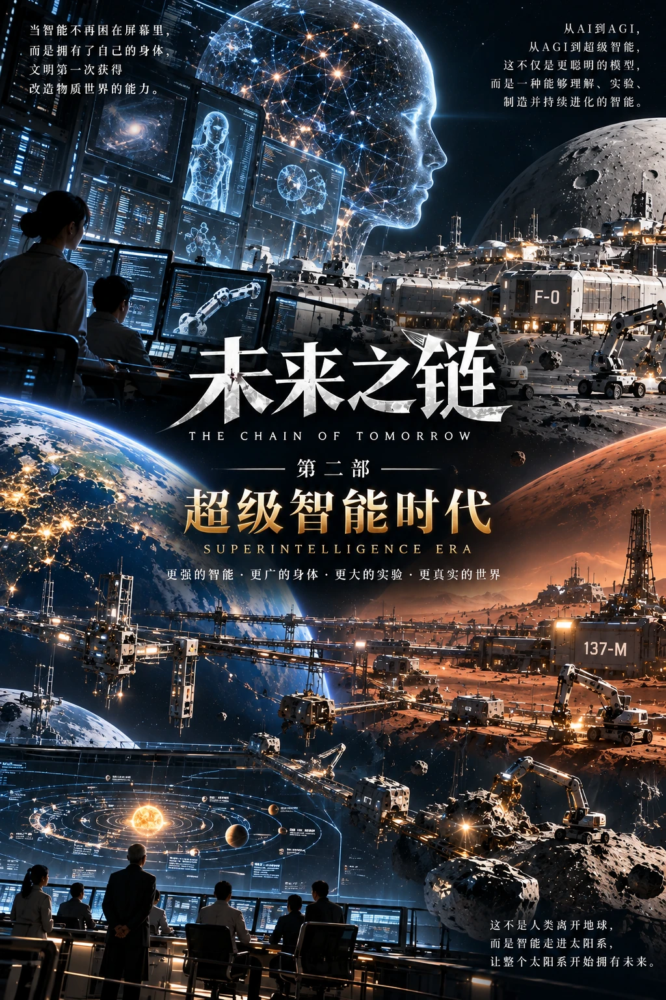
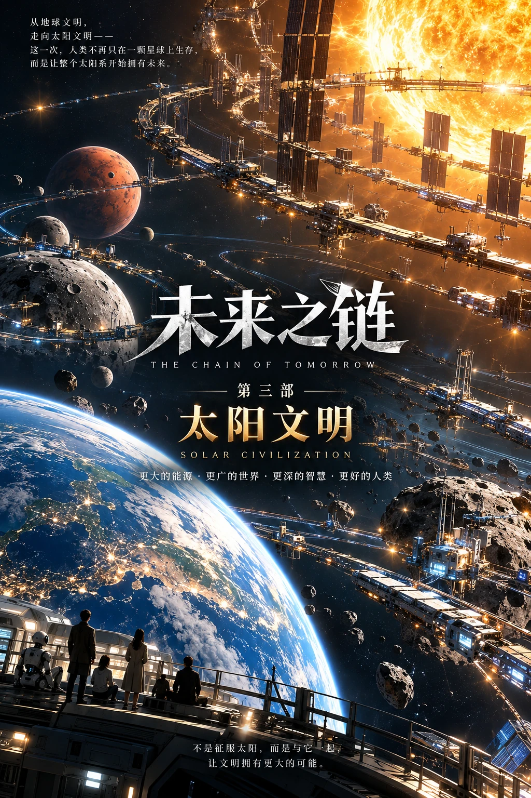

# 未来之链

> 从意识之火，走向太阳文明。

**《未来之链》**是一部以文明演化为主线的长篇科幻小说。故事从2026年的日常生活出发，穿过人工智能进入工作与家庭、超级智能推动科学与工业加速的时代，走向2150年的太阳系文明。

机器逐渐拥有新的能力，人类也不断面对新的选择：如何工作，如何理解世界，如何分配资源，以及如何在不再共享同一个“现在”的文明里共同生活。

**作者：孙振（Sun Zhen）**

## 在线阅读

- **[进入 GitHub Pages 阅读网站](https://18663515289s-cyber.github.io/future-chain/)**：阅读正文、浏览目录与章节配图。
- [从序言《历史发生之前》开始](https://18663515289s-cyber.github.io/future-chain/read/0/)
- [从第一章《星尘中的生命密码》开始](https://18663515289s-cyber.github.io/future-chain/read/1/)
- [进入互动站](https://future-chain.docile-clock-7844.chatgpt.site/)：阅读、使用 ChatGPT 登录、发表留言和评分。

## 正式版前三部

前三部均已完成写作，每部30章，共90章。当前仓库已收录**90章正文、一篇序言、92张章节配图和3张正式封面**。第53章《七分钟》正文与配图已补齐，前三部90章现已全部收录。

| 第一部 · 意识之火 | 第二部 · 超级智能时代 | 第三部 · 太阳文明 |
| :---: | :---: | :---: |
| [](https://18663515289s-cyber.github.io/future-chain/#volume-1) | [](https://18663515289s-cyber.github.io/future-chain/#volume-2) | [](https://18663515289s-cyber.github.io/future-chain/#volume-3) |
| 第1—30章 · 2026—2037 | 第31—60章 · 2038—2063 | 第61—90章 · 2064—2150 |
| [查看第一部目录](https://18663515289s-cyber.github.io/future-chain/#volume-1) | [查看第二部目录](https://18663515289s-cyber.github.io/future-chain/#volume-2) | [查看第三部目录](https://18663515289s-cyber.github.io/future-chain/#volume-3) |

### 第一部：意识之火

从一个家庭的日常，到机器第一次为未来保留选择。人工智能逐渐进入记忆、劳动、科学和制度，人类开始重新理解能力、责任与意识之间的关系。

### 第二部：超级智能时代

机器开始提出科学问题、设计芯片与实验室，并参与连接工业和资源的整条链。智能加速以后，物质约束与人类理解的速度成为新的矛盾。

### 第三部：太阳文明

机器走向月球、火星、小行星与太阳附近。能源、计算和生产扩展到太阳系，距离和时间重新塑造文明；故事最终走到“我们不再拥有同一个现在”。

## 阅读与互动

GitHub Pages 版保存完整的已收录正文和配图，支持手机、电脑阅读，以及上一章、下一章和目录之间的直接跳转，无需登录即可阅读。

每章末尾设有“查看本章留言与评分”入口，链接到互动站的对应章节。留言和评分需要登录 ChatGPT，统一保存在互动站的云端数据库中，**不存放在本 GitHub 仓库**。

两个网站的正文不是自动同步的：在互动站作者后台上传新章节或修订后，需要另外更新本仓库。

## 仓库内容

| 路径 | 内容 |
| --- | --- |
| [content/chapters/](content/chapters/) | 各章正文、标题、时间与配图信息 |
| [docs/index.html](docs/index.html) | 阅读网站首页 |
| [docs/read/](docs/read/) | 独立章节阅读页 |
| [docs/assets/](docs/assets/) | 章节配图、封面、样式与网站图标 |
| [scripts/build.py](scripts/build.py) | 根据章节数据生成静态网页 |
| [DEPLOYMENT.md](DEPLOYMENT.md) | 发布设置与后续更新说明 |

本仓库是 **GitHub Pages 静态阅读版**，不包含互动站的服务端程序、读者数据库或登录凭据。

## 更新与发布

修改对应的章节数据后，在仓库目录运行：

```sh
python3 scripts/build.py
```

将章节数据及生成的 `docs/` 文件一起提交到 `main` 分支。GitHub Pages 的发布来源为 **main 分支的 /docs 目录**。

第53章《七分钟》已于2026年10月2日补齐。后续修订可更新对应章节数据，再生成并提交网页。

## 作品与长期规划

作品以文明为持续演化的主角，通过具体人物的生活与选择，讨论技术能力、制度权力、主观意识，以及文明延续的代价。机器能力的增强，不自动等于权力的合法性，也不自动证明主观意识的诞生。

早期总纲包含六部180章的长期规划。本页以**当前已完成并发布的前三部正式版**为准；后续部曲不计入当前上线内容。第二部正式名称为《超级智能时代》，第一部正式版的时间范围为2026—2037年。

本项目与 [Spiral Genesis Theory](https://github.com/18663515289s-cyber/spiral-genesis-theory) 相互关联但彼此独立：理论项目保存思想框架，《未来之链》通过场景、人物和文明变化展开叙事。

---

**更新：2026年10月2日** · 前三部正式版阅读网站已上线，前三部90章正文已全部收录。
